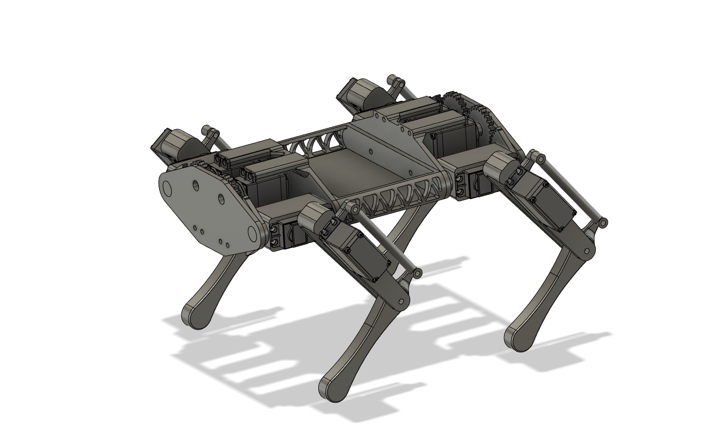

# RobotDog: ORRIN

## TODO:

* ~~Extrapolate functions of the servoPractice class into multiple classes for initialization, constant variables, etc.~~

* Add walking functionality (via setAngle() method with arrays?)

* ~~Design main chassis~~

* ~~Add offsets for joint angles for real world tuning~~

* Change structure(?) of code to allow for independent leg movement
